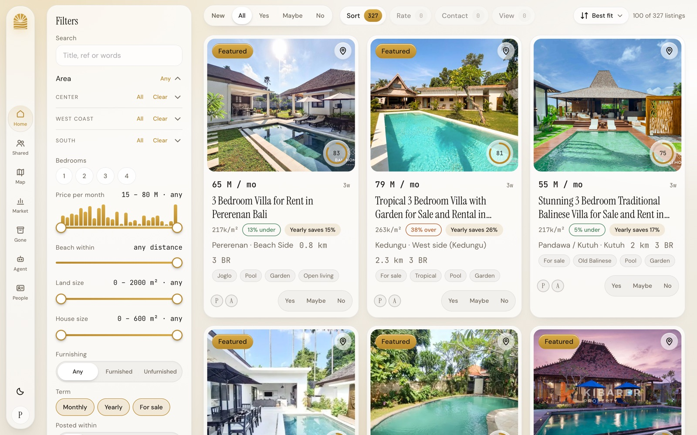
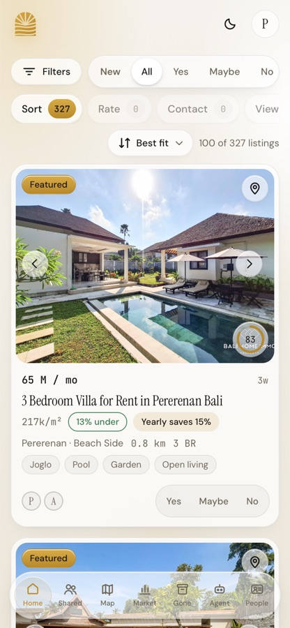
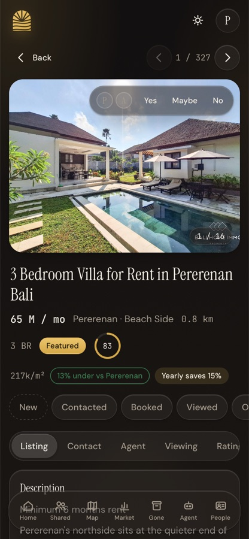
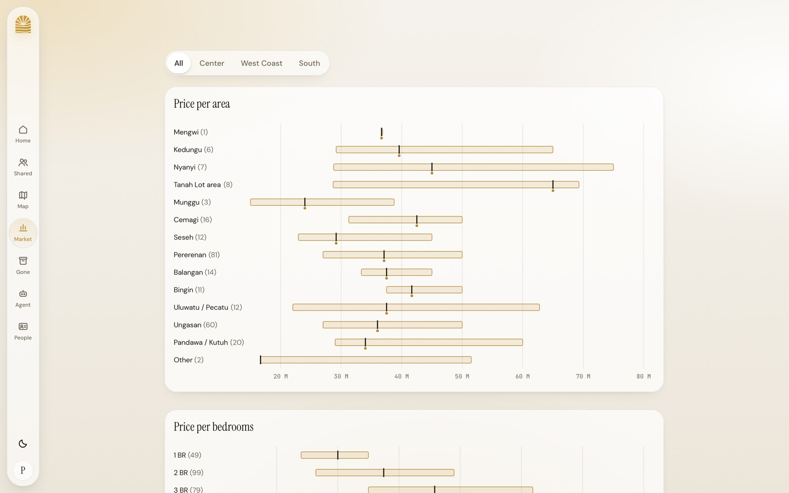

<p align="center">
  
</p>

<h1 align="center">Dream House</h1>

<p align="center">
  A private desk for finding a villa in Bali.<br>
  Every long-term rental worth knowing about, harvested daily, scored against your brief,<br>
  rated by the people you search with, and read every morning by an agent that tells you what changed.
</p>

<p align="center">
  
</p>

---

## Why it exists

Searching for a house in Bali means eight agency websites, a dozen Facebook groups, WhatsApp
forwards from friends and a notebook of "wasn't there one in Cemagi with the joglo?". Listings
disappear, reappear under another agent at a different price, and the good ones are gone in a week.

Dream House pulls all of that into one place. It knows your brief (areas, budget, bedrooms,
distance to the beach, what you love and what you won't accept), scores every listing against it,
remembers who said what about which villa, and never deletes anything, so "that one from last
month" is always a search away.

It was built by Philipp and Abigaïl for their own move, then opened to friends who are searching
too. Each team sees the same market and keeps its own verdicts, notes, visits and pipeline.

## What it does

<table>
  <tr>
    <td width="50%" valign="top"></td>
    <td width="50%" valign="top"></td>
  </tr>
</table>

- **One feed, every source.** Agency sites and portals are scraped every morning at 06:00. Facebook
  groups are harvested through a logged-in browser. WhatsApp chats are imported from exports. Any
  pasted link goes into an inbox and is fetched on the next run. See [Harvest channels](#harvest-channels).
- **Scored against your brief.** Hard filters (area, budget, bedrooms, style) decide whether a
  listing is *in filter* or just *market*. Soft weights (beach distance, view, pool, joglo, open
  living, light, workspace...) give it a fit score. Weights are editable in the app; the agent
  re-tunes them from your verdicts.
- **Rate together, standing in the villa.** Phone first. Yes / Maybe / No per person, a shared
  pipeline (new, shortlist, contacted, viewing booked, viewed, offer), notes, what the agent said, and a viewing form
  with 1–5 sliders for quiet, privacy, light, breeze and construction next door.
- **Work through the pile.** Four queues (Sort, Rate, Contact, View) walk you listing by listing
  with one-tap actions and prefilled WhatsApp messages.
- **Market view.** Price per area and per bedrooms, feature premiums, price per m², yearly
  discounts, time on market, price drops, "same villa, different price". All from your own data.
- **Map.** Every listing pinned, coloured by status, with the beaches ringed.
- **Gone, not deleted.** When a source drops a listing it moves to the archive with how long it was
  live and whether anyone called about it.
- **Duplicates folded.** The same villa from three agents (or cross-posted to five groups) becomes
  one listing with every price and link, matched by text and by perceptual photo hash.
- **A morning agent.** A small GET-only API lets a scheduled Claude session read what is new and
  what changed, write a push notification, leave notes and queue URLs.
- **Light and dark**, Instrument Serif and DM Sans, no framework, no build step.

<p align="center">
  
</p>

## Harvest channels

Every way a listing gets in. The full list of sites and groups, with status and the reason for
anything skipped, is in [harvest/channels.md](harvest/channels.md).

| Channel | How | Runs |
|---|---|---|
| Agency sites and portals | Adapters in `src/scrape/adapters/` (Bali Home Immo, Kibarer, Bali Realty, Bali Coconut Living, Uma di Bali, Apex, Livuma, Rumah123) | daily 06:00, inside the app |
| Facebook groups | `harvest/browser/harvester.js` runs inside your logged-in browser tab, driven by a Claude session; files are imported by `harvest/bin/watch.sh` | nightly, on your machine |
| WhatsApp groups and agent chats | Export the chat from the phone, then `npm run import:whatsapp -- "<export>.zip"` | when you have an export |
| Bali Villa Hub | `harvest/browser/bvh-harvester.js` (the site blocks plain requests) | on demand |
| Any link | Paste it on the Agent page or `POST /api/inbox`; the next run fetches it | daily |
| The morning agent | `GET /api/agent/inbox?token=&url=` queues a link it found | 07:00 |

Sites that are inspected and deliberately not scraped (login walls, bot challenges, sales only)
are documented one per file in [`adapters/`](adapters/).

## Set up your own

You need Node 20 or newer and about ten minutes. Everything lives in one SQLite file and one
folder of images, so there is nothing else to install.

```bash
git clone https://github.com/PhilippSolay/dream-villa.git && cd dream-villa
npm install
cp .env.example .env
```

Open `.env` and fill in:

- `SESSION_SECRET`, `ADMIN_TOKEN`, `AGENT_TOKEN`: three random strings (`openssl rand -hex 32` each).
- `USER1_*` and `USER2_*`: the two owners. Email, display name, a long passphrase. Friends are
  added later from the People page, never here.
- `NOMINATIM_EMAIL`: your address, which OpenStreetMap asks for when the app geocodes a pin.
- Leave `TZ=Asia/Makassar` and `SCRAPE_CRON=0 6 * * *` unless you want a different hour.

Then:

```bash
npm run seed -- ./seed/bhi-sweep-2026-09-17.json   # ~300 listings to look at right away
npm run dev                                          # http://localhost:8080
```

Sign in with the owner email and passphrase from `.env`. The seed gives you something to click;
the first real run fills the rest:

```bash
npm run scrape -- --source=bhi --dry   # one adapter, print what it would import
npm run scrape                          # every adapter, images, pins, dedupe, scoring
```

### Make it yours

- **The brief** lives in `config` in the database and is described in [SPEC.md §2](SPEC.md).
  Budget band, bedrooms, areas and the red flags are there; the Agent page in the app edits the
  weights and the featured threshold live.
- **Areas** (the three regions and their sub-areas, with beach points and centroids) are in
  `src/areas.js` and SPEC §7. Change them if your Bali is a different Bali.
- **People.** Owners come from `.env`. Everyone else is a member of a team, added from
  `#/people`. Verdicts are per person; pipeline, notes and visits are per team; listing facts are
  shared by all.
- **Facebook and WhatsApp** need your own logged-in browser and your own exports; the kit and
  runbooks are in [`harvest/`](harvest/README.md).

### Where to run it

The app and the harvester have different needs. The app is a server; it wants to be up all day so
phones can reach it and the 06:00 scrape runs on time. The Facebook harvester is a browser script;
it needs a real, logged-in Facebook session and a visible tab, so it runs on a person's machine.

**The app**

| | On a VPS (how Philipp runs it) | On your own machine |
|---|---|---|
| Reach | A URL that works on your phone in a villa, for every member of every team | `localhost` only, unless you add a tunnel; the phone must be on the same network |
| The daily scrape | Runs at 06:00 whether or not anyone is awake | Only runs while the laptop is open and the server is up; a missed day means a bigger catch-up |
| The morning agent | A scheduled Claude session can read `/api/agent/*` over HTTPS | Not reachable from the cloud; run the digest by hand |
| Cost and upkeep | A small VPS (one container, SQLite, about 2 GB of images after a month), a domain, a reverse proxy with TLS | Nothing to pay for, nothing to secure, and the database is a file you can open |
| Good for | Searching for real, with other people, for weeks | Trying it out, developing adapters, running an import against a copy of your data |

Start on your machine (`npm run dev`, ten minutes), then move to a VPS once you are actually
searching. The data folder (`data/villa.db` + `data/images/`) copies across as it is.

**The harvester** (Facebook groups, Bali Villa Hub)

| | On your own machine | On the VPS |
|---|---|---|
| Facebook login | Uses your own logged-in Chrome; nothing to store, no bot challenge | No session, no browser: Facebook does not work headless from a server without a stored login, which we do not want to keep there |
| Who drives it | A Claude session in the Claude app, using the Claude in Chrome extension, with you able to watch and stop it | Would need a headless browser (Playwright) and a stored cookie; possible for Bali Villa Hub, deliberately not built for Facebook |
| When it runs | At night, with the lid open and the screen unlocked; a hidden tab pauses the feed | Any time, unattended |
| Where the files go | `~/Downloads`, then `harvest/bin/watch.sh` imports them into the app over HTTPS and archives them | Would land straight in the container |
| Good for | Everything today: 47 groups a night, incremental after the first 30-day pass | Not used; the agency scrapers already run there inside the app |

So the split is: the app and the agency scrapers live on the server; the browser harvesters live on
a laptop and post their results to the server with the admin token. If you only run the app locally,
point the kit at it with `VILLA_BASE=http://localhost:8080`.

### Run it on a server

One container behind Traefik (or any reverse proxy that terminates TLS):

```bash
cp .env.example .env && nano .env
docker compose up -d --build
docker compose exec villa npm run seed -- seed/bhi-sweep-2026-09-17.json
```

`docker-compose.yml` expects an external Traefik network (`TRAEFIK_NETWORK`) and a cert resolver
(`TRAEFIK_CERTRESOLVER`); edit the `Host()` rule to your domain. Data is a bind mount at `./data`.
Deploy scripts, backups, log reading and the daily schedule are in
[docs/operations.md](docs/operations.md).

### Tests

```bash
npm test
```

## Around the repo

```
src/            Fastify server, SQLite schema and migrations, auth, teams
src/scrape/     the daily run: adapters, normalise, pins, images, dedupe, score, recheck, learn
src/jobs/       child-process workers so the web thread never blocks on a scrape or import
src/routes/     the HTTP API, including /api/agent/* for the morning session
public/         the app: one index.html, app.js, styles.css, views/, lib/ — no build step
adapters/       one markdown file per source site: what was inspected, selectors, verdict
harvest/        the browser harvesters, importers, runbooks and the channel list
seed/           a starter sweep of listings
docs/           operations notes and screenshots
test/           node --test, ~800 tests
SPEC.md         the product contract; amendments are appended, never rewritten
CLAUDE.md       working conventions for anyone (human or agent) touching the code
```

## Stack

Node 20, ES modules. Fastify, better-sqlite3, undici + cheerio for scraping, sharp for images,
node-cron for the schedule, bcryptjs and a signed HttpOnly cookie for sessions. Leaflet with
OpenStreetMap tiles. Vanilla JavaScript on the front, a tiny reactive store, no framework.

Be kind to the sites: one request per second per host, a normal browser user agent, back off on
429 and 403, cache HTML for a day. The adapters are written that way; keep it so.

## Licence

Private project shared with friends. Ask before using it for anything else.
